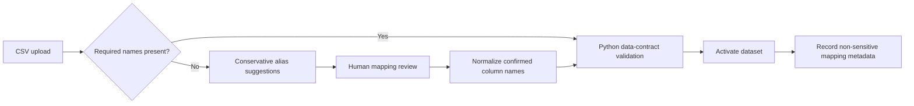
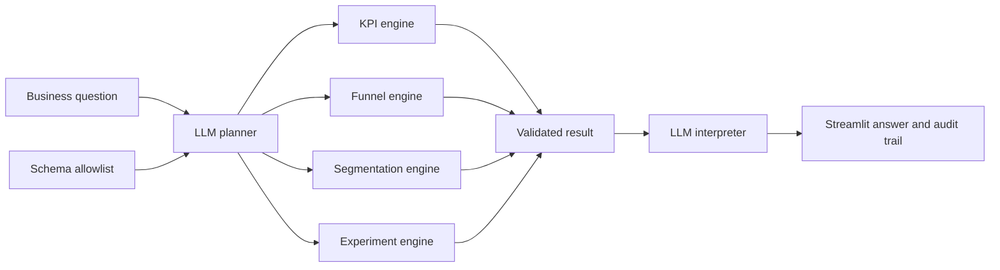

# Architecture and analytical contract

## Design principle

**The LLM handles ambiguity; deterministic Python handles numerical truth.**

1. A product manager asks a natural-language question.
2. The planner maps the question and known schema to one allowlisted workflow.
3. Python validates the dataset and computes the result.
4. The interpreter explains the immutable result and its limitations.
5. The UI exposes the plan and raw result as an audit trail.

Before question routing, a deterministic compatibility engine compares confirmed canonical fields with four use-case contracts. It never infers availability from the industry label alone: a credit-card transaction file cannot silently become an onboarding funnel, and a module remains unavailable when its required business fields are missing.

### Data ingestion and schema normalization

Mapping suggestions do not change KPI definitions. The user confirms business-semantic equivalence before normalized data reaches any analytics workflow. The audit trail records file-level provenance and confirmed source-to-target mappings, but not row-level customer data.

## Boundaries

- The LLM cannot execute arbitrary code, write SQL, invent fields, or calculate metrics.
- The MVP supports only KPI definition, funnel, three segmentation dimensions, and A/B testing.
- The experiment engine uses a two-sided two-proportion z-test and an unpooled 95% CI.
- The experiment engine checks sample-ratio mismatch against a prespecified 50/50 allocation and flags p-values below 0.01.
- Segment analysis is descriptive. Experiment interpretation assumes random assignment.
- No customer data is bundled; all demo records are synthetic.
- Uploaded mappings are session-scoped and require explicit user confirmation.

## Production hardening

Add authentication, warehouse connectors, semantic-layer governance, sample-ratio-mismatch checks, power/MDE planning, multiple-testing correction, event-order validation, PII controls, evaluation datasets, prompt/version tracing, and human approval gates.
