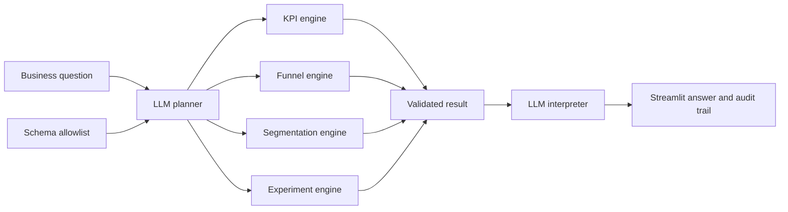

# Architecture and analytical contract

## Design principle

**The LLM handles ambiguity; deterministic Python handles numerical truth.**

1. A product manager asks a natural-language question.
2. The planner maps the question and known schema to one allowlisted workflow.
3. Python validates the dataset and computes the result.
4. The interpreter explains the immutable result and its limitations.
5. The UI exposes the plan and raw result as an audit trail.

## Boundaries

- The LLM cannot execute arbitrary code, write SQL, invent fields, or calculate metrics.
- The MVP supports only KPI definition, funnel, three segmentation dimensions, and A/B testing.
- The experiment engine uses a two-sided two-proportion z-test and an unpooled 95% CI.
- Segment analysis is descriptive. Experiment interpretation assumes random assignment.
- No customer data is bundled; all demo records are synthetic.

## Production hardening

Add authentication, warehouse connectors, semantic-layer governance, sample-ratio-mismatch checks, power/MDE planning, multiple-testing correction, event-order validation, PII controls, evaluation datasets, prompt/version tracing, and human approval gates.
