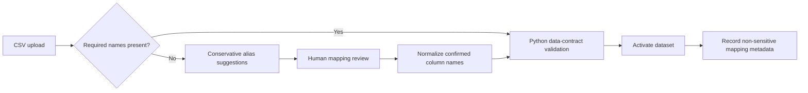
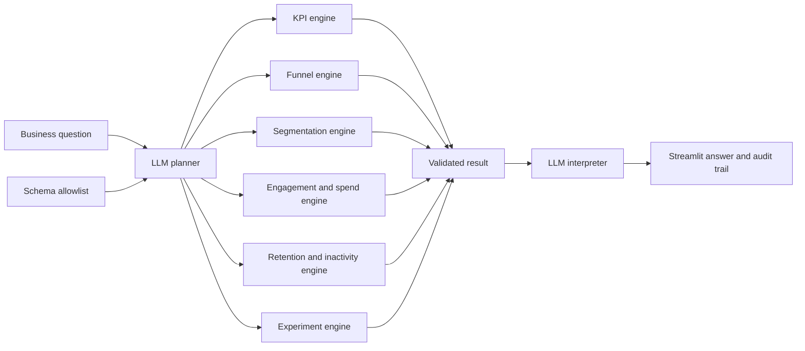

# Architecture and analytical contract

## Design principle

**The LLM handles ambiguity; deterministic Python handles numerical truth.**

1. A product manager asks a natural-language question.
2. The planner maps the question and known schema to one allowlisted workflow.
3. Python validates the dataset and computes the result.
4. The interpreter explains the immutable result and its limitations.
5. The UI exposes the plan and raw result as an audit trail.

Before question routing, a deterministic compatibility engine compares confirmed canonical fields with four use-case contracts. It never infers availability from the industry label alone: a credit-card transaction file cannot silently become an onboarding funnel, and a module remains unavailable when its required business fields are missing.

### Data ingestion and schema normalization

Mapping suggestions do not change KPI definitions. The user confirms business-semantic equivalence before normalized data reaches any analytics workflow. The audit trail records file-level provenance and confirmed source-to-target mappings, but not row-level customer data.

## Boundaries

- The LLM cannot execute arbitrary code, write SQL, invent fields, or calculate metrics.
- The MVP supports KPI definition, funnel, three segmentation dimensions, engagement/spend, retention/inactivity signals, and A/B testing within four documented credit-card use cases.
- The experiment engine uses a two-sided unpooled two-proportion z-test and a matching 95% Wald CI.
- The experiment engine checks sample-ratio mismatch against a prespecified 50/50 allocation and flags p-values below 0.01.
- Experiment validation requires unique customer IDs, complete binary outcomes, and exactly Control/Treatment group values.
- The experiment engine adds an approximate 80%-power MDE, a deterministic rollout decision gate, and descriptive consistency checks across available product dimensions.
- Segment analysis is descriptive. Experiment interpretation assumes random assignment.
- No real customer data is bundled; the app demo and `sample_data/` fixtures are synthetic.
- Uploaded mappings are session-scoped and require explicit user confirmation.
- Mapping suggestions come only from an approved exact alias allowlist. Fuzzy similarity is deliberately excluded to prevent semantic errors such as mapping `transaction_id` to `transactions_30d`.

## Production hardening

Add authentication, warehouse connectors, semantic-layer governance, prospective power planning, configurable allocation ratios, multiple-testing correction, event-order and exposure-window validation, PII controls, evaluation datasets, prompt/version tracing, and human approval gates.
